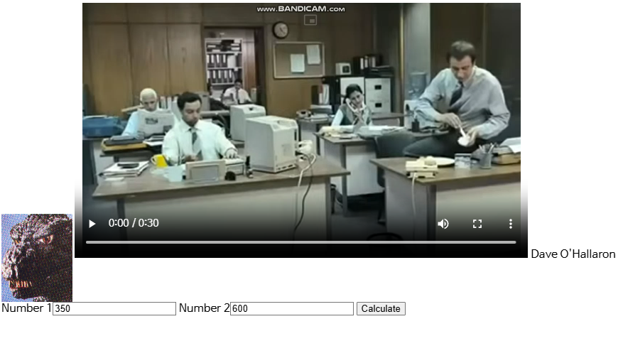

# 11.6c
- Tiny의 출력을 조사해서 브라우저의 HTTP 버전을 결정하라.

```c
/* doit 함수 내부 코드 */
// rio 함수 사용 위한 버퍼 초기화
Rio_readinitb(&rio, fd);
// 입력 한 줄 읽고, buf에 저장.
if (Rio_readlineb(&rio, buf, MAXLINE) <= 0){
    return;
}
printf("Request headers:\n");
printf("%s", buf);
```

```bash
Request headers:
GET /home.html HTTP/1.1
Connection: keep-alive
# 이하 생략
```
- 뭐 바꿔줄 필요도 없음. 요청 헤더에 자동으로 포함됨.

# 11.7
- Tiny를 확장해서 MPG 비디오 파일을 처리하도록 하시오. 실제 브라우저를 사용해서 여러분의 결과를 체크하시오.
  - HTML5는 MPG를 지원 안 해서, 부득이하게 MP4로 처리

```c
else if (strstr(filename, ".mp4"))
    strcpy(filetype, "video/mp4");
```
- `get_filetype`에 `video/mp4`에 대응되는 Content-type 추가 (이걸 꼭 해 줘야 하는진 모르겠음)

```HTML
<html>
<head><title>test</title></head>
<body> 

<video width="640" height="360" controls>
<source src="sample.mp4" type="video/mp4">
Your browser does not support the video tag.
</video>
Dave O'Hallaron
</body>
</html>
```
- 이후 `home.html`에 `video` 태그로 열어주면, 잘 처리됨


# 11.9
- Tiny를 수정해서 정적 콘텐츠를 처리할 때 요청한 파일을 `mmap`, `rio_readn` 대신에 `malloc`, `rio_readn`, `rio_writen`을 사용해서 연결 식별자에게 복사하도록 하시오.

```c
srcp = Malloc(filesize);          // filesize를 저장할 수 있는 공간 확보
Rio_readn(srcfd, srcp, filesize); // srcfd의 데이터를 메모리 scrp에 filesize만큼 복사
Close(srcfd);                     // 매핑 완료됐으니 파일 닫기. 메모리 누수 막기 위함.
Rio_writen(fd, srcp, filesize);   // 클라이언트에 파일 전송
Free(srcp);                       // 메모리 할당해제
```
- `mmap`의 역할은 메모리 공간을 할당하고, 파일을 매핑하는 것 
- 메모리 공간 할당은 `malloc`이 대신 해 줌
- 해당 메모리 주소에 파일의 데이터를 복사하기 위해, `rio_readn`을 사용
- 이후 과정은 `munmap` 대신 `free`가 사용됐다는 점 제외하고 동일함

# 11.10
- CGI adder 함수에 대한 HTML form을 작성하시오. form은 사용자가 함께 더할 두 개의 숫자로 채우는 두 개의 text box를 포함해야 하며, GET 메소드를 사용해서 컨텐츠를 요청해야 한다.
- 실제 브라우저를 이용해 Tiny로부터 form을 요청하고, 채운 form을 Tiny에 보내고, adder가 생성한 동적 콘텐츠를 표시하는 방법으로 작업을 체크하라.

```html
<form method="get" action="cgi-bin/adder">
    <label>Number 1</label><input type="number" name="num1">
    <label>Number 2</label><input type="number" name="num2">
    <button>Calculate</button>
</form>
```
- `home.html`에 위와 같은 form 추가
  - `method`를 `get`으로, `action`을 `adder` 파일의 경로로 설정하는 것 잊지 말 것
  - `input`의 `name`은 뭘로 설정하든 상관없음. 하지만 `name`이 없으면 쿼리스트링에 포함되지 않으니 뭐라도 설정할 것.




# 11.11
- Tiny를 확장하여 HTTP HEAD 메소드를 지원하도록 